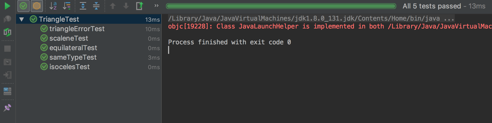

# 软件测试作业——Junit使用

[TOC]

## 题目要求

1. Install Junit(4.12),Hamcrest(1.3) with Eclipse

2. Install Eclemma with Eclipse

3. Write a javaprogram for the triangle problem and test the program with Junit. 

   Description oftriangle problem:Functiontriangle takes three integers *a,b,c*which are length of triangle sides; calculates whether the triangle isequilateral, isosceles, or scalene. 

## 解答

### 代码

Traingle类

```Java
/**
 * Created by tjliqy on 2018/3/22
 */
public class Triangle {

    //TriangleType
    public static final int EQUILATERAL = 1;
    public static final int ISOSCELES = 2;
    public static final int SCALENE = 3;

    //The length of three sides of the triangle
    private double sides[] = {0,0,0};

    private int triangleType ;

    /**
     * Construction method of Triangle
     * @param a 1st side length
     * @param b 2nd side length
     * @param c 3rd side length
     */
    public Triangle(double a,double b, double c){
        this.sides[0] = a;
        this.sides[1] = b;
        this.sides[2] = c;
        for (int i = 0; i < 3; i++) {
            int sum = 0;
            int difference = 0;
            boolean getMinuend = false;
            //得出其他两边和或差
            for (int j = 0; j < 3; j++) {
                if (j != i){
                    sum += sides[j];
                    if (!getMinuend){
                        difference += sides[j];
                        getMinuend = true;
                    }else {
                        difference -= sides[j];
                        difference = Math.abs(difference);
                    }
                }
            }
            if (sum <= sides[i] || difference >= sides[i]){
                throw new NotTriangleException();
            }
        }
        initType();
    }

    /**
     * init triangleType
     */
    private void initType(){
        if (sides[0] == sides[1] && sides[1] == sides[2]){
            triangleType = EQUILATERAL;
        }else if (sides[0] == sides[1] || sides[0] == sides[2] || sides[1] ==sides[2]){
            triangleType = ISOSCELES;
        }else {
            triangleType = SCALENE;
        }
    }

    public int getTriangleType() {
        return triangleType;
    }

    /**
     * Equals when two triangles are in same type.
     * @param obj
     * @return
     */
    @Override
    public boolean equals(Object obj) {
        if (!(obj instanceof  Triangle)){
            return false;
        }
        Triangle other = (Triangle)obj;
        return  this.getTriangleType() == other.getTriangleType();
    }
}

```

NotTriangleException类仅仅继承了RuntimeException。

TriangleTest类

```Java

import org.junit.Test;
import org.hamcrest.*;

import static org.hamcrest.CoreMatchers.equalTo;
import static org.hamcrest.MatcherAssert.*;
import static org.junit.Assert.assertEquals;


/**
 * Created by tjliqy on 2018/3/22
 */
public class TriangleTest {

    @Test(expected = NotTriangleException.class)
    public void triangleErrorTest() throws NotTriangleException {
        new Triangle(0, 0, 0);
    }

    @Test
    public void equilateralTest() {
        Triangle triangle = new Triangle(1, 1, 1);
        assertEquals(Triangle.EQUILATERAL, triangle.getTriangleType());
    }

    @Test
    public void isocelesTest() {
        Triangle triangle = new Triangle(2, 2, 3);
        assertEquals(Triangle.ISOSCELES, triangle.getTriangleType());
    }

    @Test
    public void scaleneTest() {
        Triangle triangle = new Triangle(3, 4, 5);
        assertEquals(Triangle.SCALENE, triangle.getTriangleType());
    }

    /**
     * this func use hamcrest
     */
    @Test
    public void sameTypeTest() {
        Triangle t1 = new Triangle(4, 4, 4);
        Triangle t2 = new Triangle(5,5,5);
        assertThat("failure - They are not same!", t1, equalTo(t2));

    }
}
```

### 运行结果



### Jar包引入过程

因为使用Idea作为开发工具，所以不支持Eclemma。

Junit引入流程https://blog.csdn.net/czd3355/article/details/53572989

Hamcrest在Junit4中自带。所以无需再次引入